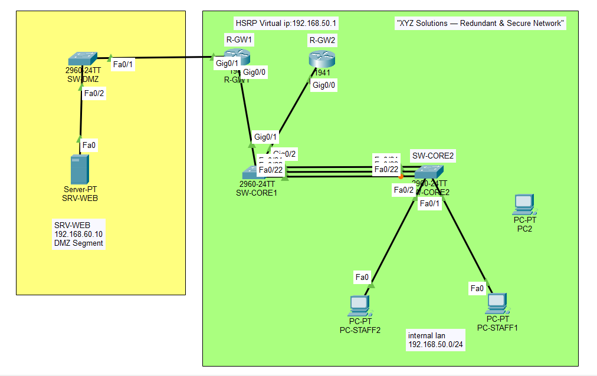

# Secure & Redundant Small Business Network (Cisco Packet Tracer)

## Objective
Designed a single-site network with redundant switch links, automatic gateway
failover, port-level security, and an isolated DMZ hosting a public-facing web
server, with traffic restrictions enforced by ACL.

## Topology

DMZ segment (yellow) is isolated from the Internal LAN (green), connected only
through R-GW1.

## Technologies Used
- EtherChannel (LACP, two bundled links between core switches)
- HSRP (gateway redundancy, tested with live failover)
- Port Security (sticky MAC, violation shutdown)
- DMZ with a stateful-style ACL (established/echo-reply based)

## IP Addressing

| Segment | Subnet | Notes |
|---|---|---|
| Internal LAN | 192.168.50.0/24 | Staff PCs |
| HSRP Virtual Gateway IP | 192.168.50.1 | Shared — PCs point here |
| R-GW1 real IP | 192.168.50.2 (Gig0/0) | Active, priority 110, preempt |
| R-GW2 real IP | 192.168.50.3 (Gig0/0) | Standby, priority 100 |
| DMZ segment | 192.168.60.0/24 | Web server |
| R-GW1 DMZ interface | 192.168.60.1 (Gig0/1) | |
| SRV-WEB | 192.168.60.10 | Public-facing server |

## Key Verification
- `show etherchannel summary` — Po1 bundled (SU), both member ports (P)
- `show standby brief` — HSRP failover tested live: R-GW1 shutdown triggered
  automatic failover to R-GW2, confirmed via ping and state-change logs
- `show port-security interface fa0/1` — sticky MAC learned; violation tested
  with a genuinely new device + generated traffic, port went to Secure-shutdown
- DMZ ACL tested: internal PCs can reach the server (ping + HTTP), server
  cannot initiate connections into the internal LAN

## Challenges Faced
- EtherChannel initially showed "SD" (not fully bundled) because
  `channel-group 1 mode active` had not actually been applied on one switch's
  interfaces — confirmed via `show running-config interface` and reapplied.
- Port security violation didn't trigger on a reconnect test because the same
  device (same MAC) was reused; also learned that port security only evaluates
  a MAC once actual traffic is sent, not just on physical connection.
- The first DMZ ACL blocked all DMZ-to-LAN traffic, which unintentionally
  blocked legitimate reply traffic (HTTP responses, ping replies) since
  standard ACLs are stateless and inspect every packet in both directions.
  Fixed by explicitly permitting `established` TCP and `echo-reply` ICMP
  traffic before the deny rule, allowing replies through while still blocking
  the server from initiating any connection into the LAN.
- The DMZ is only reachable when R-GW1 specifically is active, since it's the
  only router with a DMZ interface — a real design trade-off worth noting; a
  production network would either dual-home the DMZ or route between gateways
  to avoid this dependency.

## Files
- `/screenshots`, `/configs`, `topology.pkt`
